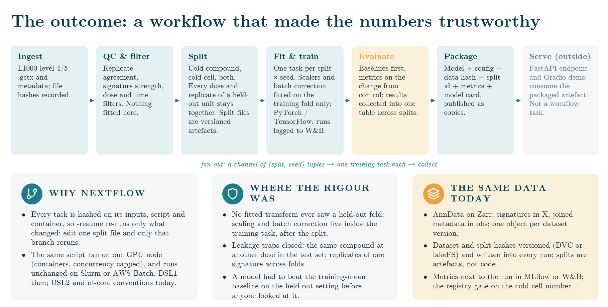

# LINCS processing

Helpers for filtering and reshaping data from the
[Library of Integrated Network-Based Cellular Signatures (LINCS)](https://lincsproject.org/)
L1000 project. You can turn the raw `.gctx` matrices plus their metadata into a
compact list of records, then slice that list by cell line, compound, dose,
time, or Repurposing Hub annotations.

## Install

The project is managed with [uv](https://docs.astral.sh/uv/) and needs
Python 3.10 or newer.

```bash
uv sync --all-groups   # creates .venv with runtime + dev dependencies
uv run pytest          # run the test suite
```

Or install it into any environment with `pip install .`.

`cmapPy` (used to read `.gctx` files) has not had a release since 2019 and does
not work with pandas 3, so pandas is pinned to `<3`.

## Data files

Nothing is bundled. Download what you need from:

- GEO [GSE92742](https://www.ncbi.nlm.nih.gov/geo/query/acc.cgi?acc=GSE92742)
  (Phase I) and [GSE70138](https://www.ncbi.nlm.nih.gov/geo/query/acc.cgi?acc=GSE70138)
  (Phase II): the level 3/5 `.gctx` matrices and the `inst_info`, `sig_info`,
  `gene_info`, and `pert_info` tables.
- The [Drug Repurposing Hub](https://clue.io/repurposing) `repurposing_drugs_*.txt`
  annotation file for mechanism of action and target information.

## Record format

Every filtering function works on a list of records. Each record is a
two-element list:

```python
record[0] == (cell_line, pert_id, pert_type, dose, dose_unit, time, time_unit)
record[1] == np.ndarray  # 978 landmark genes, or 12328 with landmarks=False
```

`parse_list_v2` uses an extended eleven-field tuple that also carries
`touchstone, clinical_phase, moa, target`.

## Usage

Build the record list from a level 3 `.gctx` file (this needs `cmapPy` and a
lot of memory for the full matrix):

```python
from lincs_processing.gctx_parser import parsing_level3_cp
from lincs_processing import write_pickle

records = parsing_level3_cp(
    "Data/Level3_INF_mlr12k_n1319138x12328.gctx",
    "Data/inst_info.txt",
    "Data/gene_info.txt",
    pert_type="trt_cp",
    landmarks=True,
)
write_pickle("Data/level3_trt_cp_landmark.pkl", records)
```

Filter records from Python. Every function accepts either a pickle path or an
already-loaded list:

```python
from lincs_processing import parse_list, parse_most_frequent, to_dataframe

mcf7 = parse_list("Data/level3_trt_cp_landmark.pkl", indicator=0, query=["MCF7"])
top3_compounds = parse_most_frequent(mcf7, indicator=1, n=3)
df = to_dataframe(top3_compounds)  # genes first, then cell_lines/compounds/doses/times
```

`indicator` selects the field: `0` cell line, `1` compound, `2` dose, `3` time.

Or filter from the command line:

```bash
uv run lincs-filter --dataset_dir Data/level3_trt_cp_landmark.pkl \
    --cells MCF7 PC3 --times 24 --output_dir Data/after_parsing.pkl
```

Metadata helpers:

```python
from lincs_processing import (
    pert_touchstone,
    duplicate_pert_name,
    drug_pert_retrieval,
    sig_info_augment,
)

by_id, by_name = pert_touchstone("Data/pert_info.txt")
dupes = duplicate_pert_name("Data/pert_info.txt")
supp, names = drug_pert_retrieval(
    "Data/repurposing_drugs_20180907.txt", "Data/pert_info.txt"
)
# adds split pert_dose / pert_time columns to a GSE70138-style sig_info
sig_info = sig_info_augment("Data/GSE70138_sig_info.txt")
```

## Perturbation-prediction workflow

A Nextflow (DSL2) workflow that trains and evaluates models predicting a
compound's level-5 L1000 signature (landmark genes, change from vehicle
control) from its structure, the cell line, dose and time.



| step | process | what it does |
|---|---|---|
| Ingest | `INGEST` | level-5 `.gctx` + metadata -> one AnnData on Zarr (signatures in `X`, joined metadata in `obs`, sha256 of every raw file in `uns`) |
| QC & filter | `QC_FILTER` | replicate agreement (`cc_q75`), signature strength (`tas`), replicate count, dose/time filters, valid SMILES. Fixed thresholds only; nothing is fitted |
| Split | `MAKE_SPLITS` | `cold_compound`, `cold_cell`, `cold_both`. All doses, times and replicates of a held-out unit stay in one fold; compounds are grouped by InChIKey block so one molecule under two BRD ids can't leak. Split files are hashed, versioned artefacts |
| Fit & train | `TRAIN` | one task per (split, seed). Scalers, cell vocabulary and batch correction (`cell_center`) are fitted on the training fold only. PyTorch MLP on Morgan fingerprint + cell + dose + time; runs logged to MLflow (or W&B) |
| Evaluate | `EVALUATE`, `COLLECT_METRICS` | baselines first (training mean, per-cell mean, per-compound mean), then the model: Pearson, cosine, R², RMSE, top-100 DEG direction. Everything is collected into `metrics/metrics.tsv` and `summary.tsv` |
| Package | `PACKAGE_MODEL` | best seed per split (by validation loss) + preprocessing + config + data hash + split id + metrics + generated `MODEL_CARD.md`, published as copies |
| Gate | `REGISTRY_GATE` | registers the cold-cell model in the MLflow registry only if it beats the training-mean baseline (`--gate_margin`, `--gate_strict`) |
| Serve (outside) | `serve/app.py` | FastAPI `/predict` + Gradio demo at `/ui`, reading a package directory |

### Quick start

Python dependencies go into the project `.venv` or the Docker image, never
into your base interpreter:

```bash
uv sync --group pipeline --group serve     # project .venv
nextflow run . -profile test,venv          # synthetic mini release, CPU, ~2 min
```

On the real CLUE 2020 beta release:

```bash
docker build -f containers/Dockerfile --target pipeline -t lincs-processing:0.3.0 .
nextflow run . -profile docker,gpu \
    --release beta \
    --gctx data/raw/beta/level5_beta_trt_cp_n720216x12328.gctx \
    --sig_info data/raw/beta/siginfo_beta.txt \
    --gene_info data/raw/beta/geneinfo_beta.txt \
    --pert_info data/raw/beta/compoundinfo_beta.txt
```

For GEO use `--release gse92742` (or `gse70138`) with the level-5 `.gctx`,
`sig_info`, `gene_info`, `pert_info` and `--sig_metrics`. `--drug_info` adds
Repurposing Hub MOA/targets. `--cell_features cells.tsv` (cell_id x features,
e.g. CCLE expression) gives unseen cell lines real features. Without it they
are encoded as all-zero.

Useful parameters (all listed in `nextflow_schema.json`): `--splits`
(comma-separated), `--seeds 0,1,2`, `--epochs`, `--hidden`,
`--batch_correction none|cell_center`, `--min_cc_q75`, `--times_h 24`,
`--tracker mlflow|wandb|none`, `--max_gpu_jobs`.

### Profiles

| profile | use |
|---|---|
| `test` | committed synthetic release in `tests/data/lincs_mini` (regenerate with `lincs-pipeline testdata`) |
| `venv` | run tasks with the project `.venv` |
| `docker` / `apptainer` | run tasks in the `lincs-processing` image |
| `gpu` | one GPU per training task (`--gpus all` / `--nv`), concurrency capped by `--max_gpu_jobs` |
| `slurm` | Slurm + Apptainer (`--slurm_partition`, `--slurm_gpu_partition`) |
| `awsbatch` | AWS Batch (`--awsbatch_queue`, `--aws_region`, S3 `-work-dir`) |

Every task is hashed on its inputs, script and container, so `-resume` reruns
only what changed: adding a seed reruns just the new training tasks and what
depends on them.

### Outputs

```
results/
  data/raw/dataset.zarr, ingest_manifest.json     # dataset version + raw file hashes
  data/filtered/filtered.zarr, qc_report.json
  splits/<split_type>.parquet, .json              # sig_id -> fold, split hash
  runs/<split_type>/                              # every (split, seed): model, predictions, metrics
  metrics/metrics.tsv, summary.tsv, gate_decision.json
  packages/<split_id>/                            # model.pt, preprocessor, config, metrics, MODEL_CARD.md
  pipeline_info/                                  # report, timeline, trace, software_versions.yml
mlflow/mlflow.db                                  # MLflow runs + model registry
```

Browse the runs with
`uv run mlflow ui --backend-store-uri sqlite:///mlflow/mlflow.db`, or point
`--mlflow_uri` at a tracking server.

### Versioning with DVC

Raw releases live in `data/raw/<release>/` and are tracked with
`uv run dvc add data/raw/beta` (see `data/raw/README.md`). `dvc.yaml` runs the
workflow as a stage (`uv run dvc repro lincs`, or `lincs_test` on the
synthetic data), versioning the dataset, split and package outputs. The data
and split hashes are also written into every MLflow run and model card.

### Serving a package

```bash
LINCS_MODEL_DIR=results/packages/cold_cell-<hash> \
    uv run uvicorn serve.app:create_app --factory --port 8000
curl -X POST localhost:8000/predict -H 'content-type: application/json' \
    -d '{"smiles": "CC(=O)OC1=CC=CC=C1C(=O)O", "cell_id": "MCF7", "dose_um": 10, "time_h": 24}'
# Gradio demo: http://localhost:8000/ui
```

Or build `--target serve` from `containers/Dockerfile`.

## Development

```bash
uv sync --all-groups         # dev + pipeline + serve into .venv
uv run ruff check .          # lint
uv run ruff format .         # format
uv run mypy src serve        # type check
uv run pytest -q             # tests (set LINCS_DATA_DIR to run the slow gctx test)
```

CI runs lint, types and the core tests on Python 3.11 and 3.13, and a second
job runs the pipeline tests plus `nextflow run . -profile test,venv` (checking
that a `-resume` rerun is fully cached).
